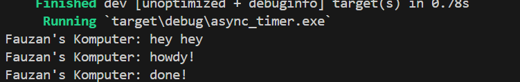
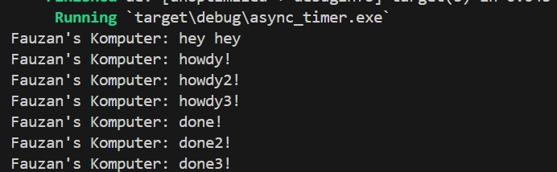
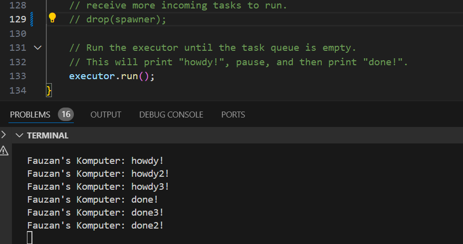

# advprog-module10-async-timer

## 1.2 Understanding how it works

Output setelah menambahkan satu baris pada main:

Hal ini terjadi karena program menerapkan async programming, 'hey hey' dicetak terlebih dahulu sebelum 'howdy!' dan 'done!' karena 'hey hey' tidak berada dalam async function.

## 1.3: Multiple Spawn and removing drop

Output setelah menambakan beberapa spawn:

Output setelah menghapus drop:

Melalui percobaan ini, kita dapat melihat bahwa menambahkan spawner artinya menambahkan task sehingga menambah antrian task yang akan dijalankan. Menghapus drop(spawner) pada program akan mengakibatkan program tidak berhenti dikarenakan drop(spawner) menjadi penanda bagi executor bahwa program telah selesai dan tidak ada task lagi yang akan dijalankan.